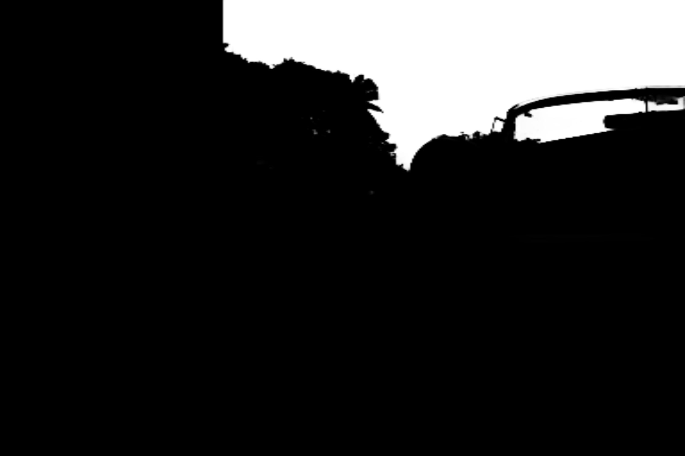

Репозиторий содержит различные этапы решения задачи сегментации неба. 
1. Ветка main - собственно это никак неизмененный форк https://github.com/knyipab/skyseg-ncnn, который круто реализовал https://arxiv.org/abs/2006.10172. Проблемы с которой стокнулся - зависимости C++, странно собранная версия open cv 4.5.5 где не работало чтение файлов. После того как установил всё правильно, чтобы Cmake искал среди /usr/, то заработало.
2. Ветка TeachingModel - SAM2.predict  получает промпты от DINO (крут в понимании картинки), поверх которого простенький классификатор, набор промптов. Так разметил датасет, обучил U2Net. Датасет я собрал посредственный, результат получился такой же
3. Ветка SAM2Try - пробовал AutomaticMaskGenerator - так как для SAM2 нужен промпт, была идея испошльзовать маск_генератор, разбить всю фотографию на куски, обучить легковесную модель говорить "этот сегмент (не) небо", оказалось что маск_генератор работает медленно и точность у него скудная
4. Ветка OutOfTheBoxSolution - взял `nvidia/segformer-b5-finetuned-ade-640-640` (модель для сегментации), ID класса неба 2, качество не очень, возможно стоило попробовать Detectron2, но предыдущие подходы уже дали крутой результат
5. Ветка FirstAttempts - ставил SegmentAnything2 от Meta https://github.com/facebookresearch/sam2, затем вручную вводил промпт, есть скрипт для скачивания ADE20k

Из планов: самое крутое решение - первое. Непонятно зачем нам нужен C++, так что хочется перевести всё на Python для удобного ВСЕГО

  

